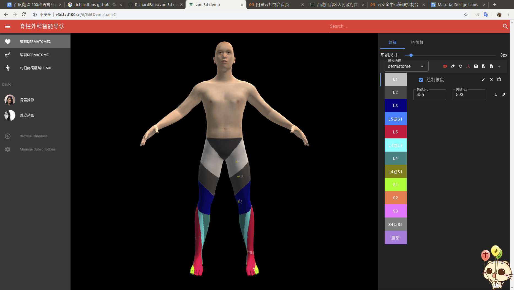
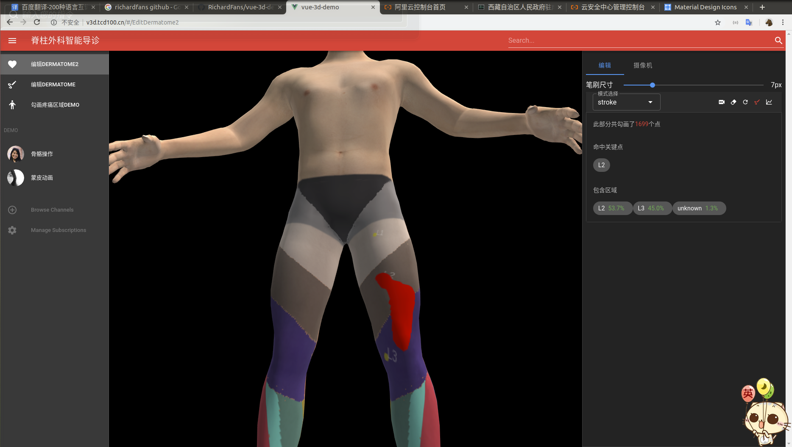

# vue-3d-demo(Dermatome)

## Preview

### Edit Dermatome



### Stroke On Body




## Project setup

```
npm install
```

### Compiles and hot-reloads for development
```
npm run serve
```

### Compiles and minifies for production
```
npm run build
```

### Lints and fixes files
```
npm run lint
```

### Customize configuration
See [Configuration Reference](https://cli.vuejs.org/config/).

## 学习心得 Q&A

Q1:WEB 3D用什么框架？

A1:WEBGL接口相对底层，推荐用

[threejs](https://threejs.org/)

Q2:如何快速入门？

A2:THREEJS提供了丰富示例，从示例中寻找和自己需求相近的例子，在配合阅读理解，就能快速入门

Q3:如何在THREEJS中使用人体模型？

A3:首先是制作人体模型，推荐使用

[makehuman](http://www.makehumancommunity.org/content/downloads.html) ，制作后可以导出为fbx格式，再使用blender打开导出为gltf格式，参考THREEJS示例代码或文档导入此gltf格式模型

A4:为什么不使用骨骼动画？

Q4:在工程所使用Threejs版本上（0.118.3），带骨骼且执行了骨骼动画的模型，Raycaster射线在某些部位或区域无反应，也就是没办法完全捕捉鼠标或触屏在带动画的模型上的交互行为，因此放弃了动画模型

A5:如何实现在人体模型上自由绘图？

Q5:

2D方案：


